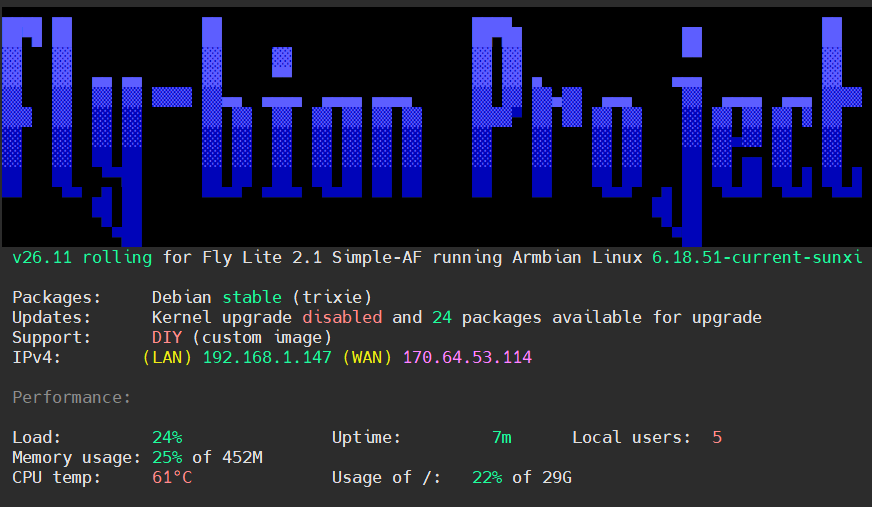

# Fly-bian Project



## What is Fly-bian?

**Fly-bian** is unofficial [Armbian](https://www.armbian.com/) (Debian) firmware for [Mellow Fly](https://mellow.klipper.cn/en/docs/ProductDoc/SBC/fly-lite/lite2/) single-board computers used as Klipper hosts. It is **not FlyOS** and **not an official Mellow product**.

It exists so you can run a normal Debian system on Fly hardware: real `apt`, a user account you create, SSH, and the board’s Wi‑Fi, UART, HDMI/TFT, and USB — without being locked into FlyOS.

**What it is for:** flash a MicroSD, boot the board, and run a Klipper stack (or install one later) with Fluidd/Mainsail over the network. Aimed at people who want Debian-class tooling on a Fly Lite / Fly Pi, not a closed appliance image.

**How it works:**

1. Download a named `.img.xz` from [GitHub Releases](https://github.com/0dysseusRex/fly-bian/releases).
2. Write it to a MicroSD card (Pi Imager, Etcher, or `dd`).
3. Edit the small **`FLY-SETUP`** volume (`fly-start.txt`) for Wi‑Fi and accounts — or use serial/HDMI for the first-run wizard.
4. Boot: the rootfs expands, a swapfile is created, and (on stack images) Klipper trees are bound into your home.
5. SSH in and finish printer setup with `fly-start` (Simple-AF) or `fly-kiauh` (KIAUH).

**Boards:** [Fly Lite 2.1](docs/boards/fly-lite-2.1/README.md) is supported first. [Fly Pi V3](docs/boards/fly-pi-v3/README.md) is next. Do not flash a Lite image onto a Pi V3 (or the reverse).

**First-time flash guide:** [`docs/wiki/Getting-Started.md`](docs/wiki/Getting-Started.md) (also on the [GitHub Wiki](https://github.com/0dysseusRex/fly-bian/wiki) once published) — download → burn → first boot for each board.

### The three images

Every release ships three flavors for the same board. Pick **one** — do not mix Simple-AF and KIAUH on the same card.

| Image | What’s on the card | Who it’s for |
| --- | --- | --- |
| **Base** (`…_Base.img.xz`) | Armbian/Debian + Fly Lite hardware (DTB, Wi‑Fi, UART, TFT Cap/GT911, swap, first-boot helpers). **No** Klipper stack. | You want a clean Debian host and will install Simple-AF or KIAUH yourself later. |
| **Simple-AF** (`…_Simple-AF-….img.xz`) | Everything in Base, plus [pellcorp Simple-AF](https://github.com/pellcorp/creality) (Klipper/Moonraker/UIs/pellcorp) pre-baked under `/opt`. After login: `fly-start`. Prefer **GrumpyScreen** on 512 MB. | You want the pellcorp / Creality-style installer path with printer macros and a guided `installer.sh`. Upstream RPi docs: [creality-wiki/rpi](https://pellcorp.github.io/creality-wiki/rpi/). How-to: [`docs/howto-simpleaf.md`](docs/howto-simpleaf.md). |
| **KIAUH** (`…_KIAUH-….img.xz`) | Everything in Base, plus [KIAUH](https://github.com/dw-0/kiauh) and stock Klipper/Moonraker/Fluidd/Mainsail pre-baked under `/opt`. After login: `fly-kiauh`. | You prefer the classic KIAUH menu to enable components and write `printer.cfg`. How-to: [`docs/howto-kiauh.md`](docs/howto-kiauh.md). |

Flashable images live only on **[Releases](https://github.com/0dysseusRex/fly-bian/releases)** (not in git). This repo holds the patches, overlays, and docs.

Do **not** flash Raspberry Pi OS, Mainsail OS, or other Fly SBC / Gemini images onto the Lite.

## Support

If Fly-bian helps your printer, you can [buy me a coffee on Ko-fi](https://ko-fi.com/0dysseusrex).

## How this project is built (AI-first)

Fly-bian is **heavily AI-assisted**. Day-to-day bring-up, overlays, docs, bake scripts, live serial/SSH diagnosis, and release prep are done in [Cursor](https://cursor.com) with an AI coding agent (**Auto** / Composer) working alongside a human maintainer who owns hardware, flashing, and final calls.

Expect:

- Agents that read the board, edit the tree, and drive long Armbian bakes
- Docs and helpers written for that workflow (and for humans reproducing builds)
- Mistakes caught by flashing and testing on real Fly hardware — treat AI output as draft until verified on a card

If you contribute, AI-authored patches are welcome when they are reviewed on hardware the same way.

## Fly Lite 2.1 in one page

Compact Allwinner **H3** host (512 MB, **MicroSD only**, no eMMC). Onboard 2.4 GHz Wi-Fi (IPEX), two USB-A, Type-C power + UART, FPC-HDMI, FPC-TFT. Independent **5 V**. Do not power it from a printer MCU.

Full hardware overview: **[`docs/boards/fly-lite-2.1/README.md`](docs/boards/fly-lite-2.1/README.md)**.

Working images use Fly’s `sun8i-h3-fly-lite.dtb`, heartbeat LED, `wlan0` (8189fs on **CPU0**), TFT DRM. systemd drop-ins pin Klipper-family units to CPUs **1–3**.

## First boot (named image)

After flashing, **eject, unplug, and replug** the card so the small FAT volume appears. Windows, macOS, and Linux can all read it. Label is `FLY-SETUP`.

On that volume you will find:

- `fly-start.txt` — Wi-Fi, locale/timezone, root, sudo user; Simple-AF also has install/boot-display/AUTO_CAMERAS keys; KIAUH is Wi-Fi/accounts only
- `README.txt` — the same three setup paths, written for a first-time user

Then put the card in the Lite, fit the IPEX antenna, and apply 5 V. First boot **expands the Debian partition** to fill the card and creates a 2 GB `/swapfile`. That can take several minutes.

### 1. Text file (headless SSH)

Armbian’s wizard only runs on serial or HDMI, so Wi-Fi in the file by itself cannot give you SSH. Fill **Wi-Fi + root + user** (and ideally locale/timezone) **before** the first power-on. `Your…` placeholders are ignored.

1. Open `fly-start.txt` on `FLY-SETUP` (Notepad is fine).
2. Set `WIFI_SSID`, `WIFI_PSK`, `WIFI_COUNTRY`. Leave `USE_STATIC=0` unless you need a static IPv4.
3. Set `LOCALE` / `TIMEZONE` (examples in the file).
4. Set `ROOT_PASSWORD`, `USER_NAME` (lowercase login), `USER_PASSWORD`.
5. Optionally set `INSTALL_CMD`, `AUTO_CAMERAS`, `ENABLE_GRUMPYSCREEN`, `INSTALL_BOOT_DISPLAY` for later `fly-start` (Simple-AF only).
6. Eject the volume. Card back in the Lite. Power on.
7. Wait for resize + radio (often several minutes), then `ssh USER_NAME@THE.PRINTER.IP`.
8. Run `fly-help`, then `fly-start` (Simple-AF) or `fly-kiauh` (KIAUH).

Leave root or user as `Your…` and the on-screen wizard still runs. 2.4 GHz only. Passwords in the file are plaintext. There is no pre-made `fly` account unless you type that name yourself.

### 2. Serial

Type-C to the PC, **115200 8N1**, no flow control. Data-capable cable. On Windows this is often **COM4**. Do **not** pulse DTR/RTS (it does not reset this board; it can drop you into U-Boot). Finish the wizard on the serial console.

### 3. Keyboard and screen

FPC-HDMI (or a USB-A HDMI adapter is not a thing — use the FPC) plus a USB keyboard. Leave the FPC-TFT unplugged for first boot. Complete the wizard on that console.

`reboot` on this hardware often hangs. Use a **5 V power cycle**. Space power cycles (or hard resets) a few minutes apart — cycling too quickly or too often often leads to hung boots or kernel oops.

## After first login

```bash
fly-help                  # install tips + custom commands
fly-start                 # Simple-AF only — install/update / boot display menu
fly-kiauh                 # KIAUH only — Start KIAUH / Add USB cameras
fly-kiauh cameras         # KIAUH — USB cams into Crowsnest (same as fly-crowsnest-add-cams)
sudo apt update
# Do not apt-upgrade kernel, DTB, or U-Boot until those are in a named rebuild.
```

On the **base** image, Klipper is optional — install Simple-AF or KIAUH later as your normal user. On the **Simple-AF** or **KIAUH** named images the git trees and venvs are already on the card; first boot copies them into your home. CPU affinity for those units is already on every flavor (`klipper/cpu-affinity/`).

On this 512 MB board, several Simple-AF **and** KIAUH steps look hung but are still working: `git clone` (Moonraker especially — `Receiving objects` / `index-pack` over 8189fs), then `apt-get` of build deps. Progress is on the SSH/wizard session, not COM4. Wait if git or apt is still moving. Do not reboot. Details: [`docs/fly-lite-armbian-notes.md`](docs/fly-lite-armbian-notes.md#simple-af-and-kiauh-looks-hung-still-working).

### RAM-heavy modules (512 MB — Simple-AF and KIAUH)

The Lite has **512 MB RAM**. Heavy apps often **OOM** (process `Killed` / exit 137), leave **`dpkg` segfaults**, or break apt mid-install. Prefer phone/PC companion apps when offered.

**Avoid:** OctoEverywhere (on-device — use the companion app), OctoApp, Obico, OctoPrint, Spoolman (Docker), KlipperScreen / DroidKlipp.  
**Caution (at most one):** Mobileraker, Moonraker Telegram Bot, Moongate.  
**Usually OK:** SimplyPrint, KAMP, TMC Autotune, themes / PrettyGCode, Klipper-Backup.

**Diagnose / repair / finish a failed install:** [`docs/boards/fly-lite-2.1/oom.md`](docs/boards/fly-lite-2.1/oom.md) (`free -h`, `dmesg` OOM lines, `dpkg --configure -a`, one-package-at-a-time retries).

**How-tos:** Simple-AF — [`docs/howto-simpleaf.md`](docs/howto-simpleaf.md) (links to [pellcorp/creality](https://github.com/pellcorp/creality) and the [RPi wiki](https://pellcorp.github.io/creality-wiki/rpi/)). KIAUH — [`docs/howto-kiauh.md`](docs/howto-kiauh.md). Stay on GrumpyScreen for Simple-AF; skip KlipperScreen when you can.

### USB cameras (Crowsnest)

After Crowsnest is installed (Simple-AF/`make install` or KIAUH), plug in a UVC webcam and from SSH:

```bash
fly-crowsnest-add-cams          # discover cams, edit ~/printer_data/config/crowsnest.conf, restart
fly-crowsnest-add-cams --dry-run
```

Uses stable `/dev/v4l/by-id/…-video-index0` paths and skips the H3 cedrus encoder. Re-run after plugging another cam; already-configured devices are left alone. Stream example: `http://<board-ip>:8080/?action=stream`. On Simple-AF, set `AUTO_CAMERAS=Yes` in `fly-start.txt` to run this after a full `fly-start` install. On KIAUH, use `fly-kiauh cameras` or `fly-crowsnest-add-cams`.

### GrumpyScreen rotation

```bash
fly-grumpy-rotate          # show current
fly-grumpy-rotate 0        # 0°
fly-grumpy-rotate 1        # 90°
fly-grumpy-rotate 2        # 180°
fly-grumpy-rotate 3        # 270° (image default)
```

Writes `~/printer_data/config/grumpyscreen.ini` and restarts GrumpyScreen. Changing rotation triggers touch recalibration. Set `ENABLE_GRUMPYSCREEN=Yes` in `fly-start.txt` to enable GrumpyScreen after a full `fly-start` install. Set `INSTALL_BOOT_DISPLAY=Yes` for the Plymouth early-boot splash (not GrumpyScreen). Toggle later with `fly-boot-display enable|disable` or fly-start menu 3/4. Rotate from fly-start menu 5/6 or `fly-grumpy-rotate`.

### Boot display (Plymouth)

Simple-AF images bake `plymouth` + the Simple-AF theme. Default is off (`bootlogo=false`) to keep early boot light on 512 MB.

```bash
fly-boot-display status
fly-boot-display enable    # Simple-AF splash; reboot to apply
fly-boot-display disable   # text boot sequence for diagnostics; reboot to apply
```

Or set `INSTALL_BOOT_DISPLAY=Yes` in `fly-start.txt` (full install) / fly-start menu 3–4.

## Other Fly boards

| Board | Status | Notes |
| --- | --- | --- |
| Fly Lite 2.1 | Now | This README. H3, MicroSD only. |
| Fly Pi V3 | Next | H618, Ethernet, optional FLY M2WE eMMC. New board file, not a Lite respin. |
| Fly Pi V2, MiniPad, Gemini | Later | Different SoCs. Same first-boot idea, different images. |

## This repo

| Path | What it is |
| --- | --- |
| `FLYBIAN_VERSION` | Product version (`0.2` … `1.0`). Bump before every new image (`scripts/bump-flybian-version.sh`). See [`docs/image-naming.md`](docs/image-naming.md) |
| `first-boot/` | `fly-start.txt` + `README.txt` that belong on `FLY-SETUP` |
| `scripts/prepare-sd.sh` | Copy those files onto a mounted FAT volume |
| `scripts/stage-flybian-release.sh` | Rename/copy Armbian output to Fly-bian product names |
| `docs/build-named-image.md` | How to **build** the named Lite 2.1 image (Armbian userpatches) |
| `docs/image-naming.md` | Fly-bian release filename scheme |
| `armbian/userpatches/` | Board file, customize hook, overlay for that build |
| `docs/fly-lite-armbian-notes.md` | Lab log (working cpu-affinity card) |
| `docs/lite21-bringup.md` | U-Boot paste if a stock Orange Pi Lite image will not autoboot |
| `docs/images.md` | Bench `.img.gz` dumps and SHA256 |
| `overlays/` | Device-tree overlays |
| `klipper/` | CPU affinity + host-side Klipper fragments (not a Klipper tree) |

## Building an image

A named image is produced with the [Armbian build framework](https://github.com/armbian/build), not by `dd` of a 32 GB card. Follow [`docs/build-named-image.md`](docs/build-named-image.md). From WSL: `scripts/run-armbian-compile.sh base|simpleaf|kiauh`. That build needs a Linux host with Docker or a native Armbian build tree, and the Lite on the bench to verify autoboot, Wi-Fi, serial, and resize.
