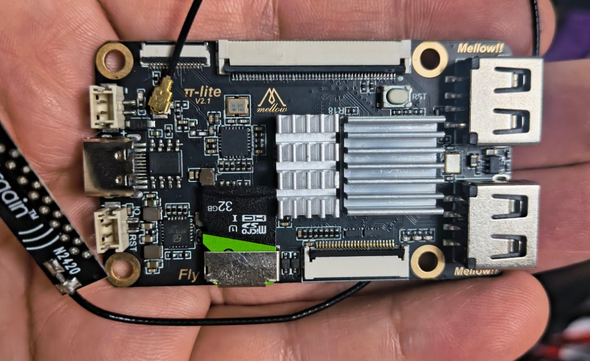

# Fly Lite 2.1 — board README

**Status:** Supported (Fly-bian 1.0)  
**Vendor docs:** [Mellow — Fly Lite 2](https://mellow.klipper.cn/en/docs/ProductDoc/SBC/fly-lite/lite2/)  
**Armbian boards:** `fly-lite-21`, `fly-lite-21-simpleaf`, `fly-lite-21-kiauh`  
**DTB:** `sun8i-h3-fly-lite.dtb`

Unofficial Debian/Armbian for this PCB — **not FlyOS**. Flash only Fly-bian images built for **Fly-Lite-2.1**. Do not use Raspberry Pi OS, Mainsail OS, or other Fly SBC images.

---

## Hardware overview

| Item | Detail |
| --- | --- |
| SoC | Allwinner **H3** (quad Cortex-A7) |
| RAM | **512 MB** DDR (tight for Klipper + UI + cams — see [OOM guide](oom.md)) |
| Storage | **MicroSD only** — no eMMC |
| Power | Independent **5 V** (barrel / board supply as per Mellow). **Do not** power from a printer MCU 5 V rail |
| Wi-Fi | Onboard **2.4 GHz** RTL8189FTV (SDIO), **IPEX** antenna connector — fit the antenna before first boot |
| Ethernet | None onboard |
| USB | **2× USB-A** host |
| Debug / UART | **Type-C** with CH340-class USB-UART — **115200 8N1**, no flow control |
| Display | **FPC-HDMI** (HDMI5-style) and **FPC-TFT** (Fly TFT V2 family) |
| LEDs | Status / power / Wi-Fi (GPIO in Fly DTB) + TFT backlight GPIO |

### Connectors (practical)

- **Type-C** — power path depends on your cable/PSU; serial console is on the same connector’s UART. Use a data-capable cable for COM port access.
- **IPEX Wi-Fi** — required for `wlan0`. Without the antenna, range and association are poor or fail.
- **FPC-HDMI** — primary “big screen” for the first-run wizard if you are not using serial/SSH. Leave FPC-TFT unplugged for first wizard if you want a simple path.
- **FPC-TFT** — 16-pin FPC to Fly TFT V2 (ST7796 SPI). Cable orientation can be **reversed** vs some Pi harnesses; if the backlight is on but the panel stays white/blank, try flipping the FPC.
- **USB-A** — keyboard for HDMI wizard, webcams (Crowsnest), flash drives. Avoid stacking heavy USB gadgets during first boot.

### Power and reset behavior

- Soft `reboot` **often hangs** — use a **5 V power cycle**.
- Space power cycles **a few minutes apart**. Rapid cycling correlates with hung boots and kernel oops.
- Do **not** pulse DTR/RTS on the USB-UART thinking it resets the SoC — it does not hard-reset this board and can drop you into U-Boot or drop the COM port.

---

## Boot / firmware map (Fly-bian)

| Piece | Role |
| --- | --- |
| U-Boot + Linux | Card-detect must treat SD as always present (`broken-cd` / `mmc-broken-cd`) — Orange Pi Lite’s **PF6 CD** is wrong on this PCB |
| `fdtfile` | `sun8i-h3-fly-lite.dtb` |
| User overlays (typical) | `mmc-broken-cd` `fly-lite-io` `fly-lite-tft` `fly-lite-tft-c` `fly-lite-hdmi` |
| Kernel cmdline extras | `maxcpus=1` then online isolated CPUs; `isolcpus=1-3` `irqaffinity=0` `cma=16M` … |
| Swap | **2 GiB `/swapfile`** created on first boot after rootfs grow |

First-boot FAT volume label: **`FLY-SETUP`** (`fly-start.txt` + README).

---

## CPU and Wi-Fi (critical)

`8189fs` (RTL8189FTV) is **not SMP-safe** on this board. Failure mode is often a **silent SDIO lockup** (Wi-Fi dies) rather than a clean oops.

| Rule | Why |
| --- | --- |
| Boot with **`maxcpus=1`** | Lets 8189fs come up cleanly |
| Then online CPUs 1–3 as **isolated** (`fly-online-isolated-cpus.service`) | Klipper stack runs on 1–3; radio stays on CPU0 |
| Keep MMC / Wi-Fi IRQs on CPU0 | `irqaffinity=0` |
| Do **not** boot all four cores from t=0 | Wi-Fi often never joins the LAN |

Klipper-family units use systemd `CPUAffinity=1-3` (drop-ins). Do not wrap `ExecStart` with `taskset` (installers rewrite units).

---

## GPIO / LEDs (Fly DTB)

Present in the Fly base DTB (do **not** load a duplicate `fly-lite-leds` overlay — `-EBUSY`):

| Function | Notes |
| --- | --- |
| Status | PG12 heartbeat |
| Power | PG13 |
| Wi-Fi | PG11 |
| TFT backlight | **PA6** (`gpio-leds`) |

---

## Displays

### FPC-HDMI

- Fly DTB may ship HDMI **disabled**; Fly-bian loads `fly-lite-hdmi` and `disp_mode=800x480p60` (adjust if your panel differs).
- Useful for first-boot wizard + keyboard.

### Fly TFT V2 (SPI)

| Item | Detail |
| --- | --- |
| Panel | ST7796, **320×480**, RGB565 |
| Driver | `panel-mipi-dbi` + `/lib/firmware/ST7796S.bin` |
| SPI pins | DC **PA20**, reset **PA21**, CS0 **PC3**, CS1 **PA19** |
| Framebuffer | `/dev/fb0` when the module is loaded (`modules-load.d/fly-tft.conf`) |
| Cap touch (default bake) | GT911 on **i2c2** @ **0x14**, IRQ **PA3**, reset **PA2** (`fly-lite-tft-c`) |
| Resi touch | ADS7846 on SPI CS1 — omit `fly-lite-tft-c` from `user_overlays` |
| Helper | `fly-tft-check` |
| UI rotate | `fly-grumpy-rotate` (GrumpyScreen on `/dev/fb0`) |

Cap vs Resi is a **DIP on the TFT**, not a different SPI panel wiring.

---

## Memory (512 MB)

Heavy installs OOM, segfault `dpkg`, or break apt. Full diagnosis and recovery:

→ **[oom.md](oom.md)**

Summary: avoid on-device OctoEverywhere / Docker / KlipperScreen; prefer GrumpyScreen or browser UIs; repair with `dpkg --configure -a`.

---

## Serial console

| Setting | Value |
| --- | --- |
| Port | Type-C UART (Windows often **COM4**) |
| Speed | **115200 8N1** |
| Flow control | None |
| DTR/RTS | Do not pulse for “reset” |

Autoboot countdown is short — easy to miss after a USB re-enum.

---

## Fly-bian software map

| Flavor | After login |
| --- | --- |
| Base | Hardware + wizard; install Simple-AF or KIAUH yourself |
| Simple-AF | `fly-start` — [`howto-simpleaf.md`](../../howto-simpleaf.md) · upstream [Simple-AF RPi](https://pellcorp.github.io/creality-wiki/rpi/) |
| KIAUH | `fly-kiauh` — [`howto-kiauh.md`](../../howto-kiauh.md) · [`kiauh-fly-lite.md`](../../kiauh-fly-lite.md) |

Common helpers: `fly-help`, `fly-crowsnest-add-cams`, `fly-grumpy-rotate`, `fly-tft-check`, `fly-boot-display`, `fly-moonraker-polkit`.

---

## Related docs

| Doc | Topic |
| --- | --- |
| [oom.md](oom.md) | OOM / segfault / finish installs |
| [`../../fly-lite-armbian-notes.md`](../../fly-lite-armbian-notes.md) | Lab bring-up diary |
| [`../../build-named-image.md`](../../build-named-image.md) | Image bake requirements |
| [`../../lite21-bringup.md`](../../lite21-bringup.md) | Early U-Boot / PF6 notes |
| [Main project README](../../../README.md) | Flash table, AI-first workflow |
