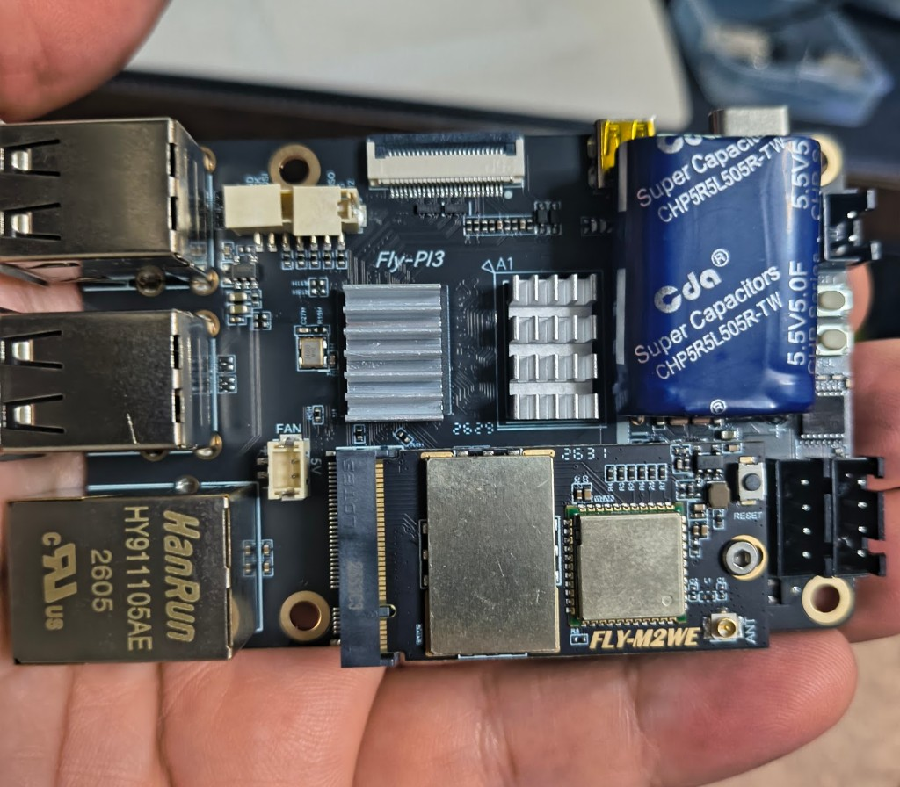

# Fly Pi V3 — board README

**Status:** Next target (after Fly Lite 2.1 / Fly-bian 1.0)  
**Vendor docs:** *(add Mellow Fly Pi V3 link when confirmed)*  
**Armbian boards:** *(planned)* `fly-pi-v3`, `fly-pi-v3-simpleaf`, `fly-pi-v3-kiauh`  
**DTB:** TBD

Unofficial Debian/Armbian for this PCB when bring-up lands — **not FlyOS**. Do **not** flash Fly-Lite-2.1 images onto a Pi V3.

---

## Hardware overview

Fill in from the physical board and Mellow documentation during bring-up. Do not invent pinmux.

| Item | Detail |
| --- | --- |
| SoC | TBD |
| RAM | TBD |
| Storage | TBD (eMMC? MicroSD?) |
| Power | TBD — note MCU vs dedicated 5 V |
| Wi-Fi / Ethernet | TBD (chip, antenna, driver) |
| USB | TBD |
| Debug / UART | TBD (connector, baud, CH340 vs other) |
| Display | TBD (HDMI, DSI, FPC-TFT, etc.) |
| Other I/O | TBD (CAN, SPI, I2C headers, ADCs) |

### Connectors (practical)

- Document each user-facing connector, cable orientation traps, and “fit antenna first” style gotchas here.

### Power and reset behavior

- Soft reboot behavior TBD  
- Whether USB-UART DTR/RTS resets the SoC TBD  

---

## Boot / firmware map (planned)

| Piece | Role |
| --- | --- |
| U-Boot / DTB | New board files — do not reuse Lite overlays blindly |
| User overlays | Per-V3 pinmux only |
| CPU / Wi-Fi policy | Revisit SMP rules if the radio differs from 8189fs |

---

## Displays

TBD — separate SPI TFT path from Lite if pinmux differs.

---

## Memory

TBD — if RAM is still tight, link an `oom.md` sibling like Lite 2.1.

---

## Serial console

| Setting | Value |
| --- | --- |
| Port | TBD |
| Speed | TBD (often 115200 8N1) |
| Flow control | TBD |
| DTR/RTS | TBD |

---

## Bring-up checklist

1. Confirm SoC, RAM, storage, UART on a live board  
2. Capture vendor DTB / FlyOS reference if available  
3. Add Armbian `BOARD=fly-pi-v3` (+ flavor boards)  
4. Prove SD/eMMC, network, then display/touch  
5. Port helpers (`fly-help`, affinity pattern) only where they still apply  
6. First public image: Base-only until Wi-Fi + Klipper path is verified  

---

## Related docs

| Doc | Topic |
| --- | --- |
| [Board index](../README.md) | All boards |
| [Main project README](../../../README.md) | Project overview |
| [`../../fly-lite-armbian-notes.md`](../../fly-lite-armbian-notes.md) | Lite lessons (Wi-Fi/CPU patterns may or may not transfer) |
